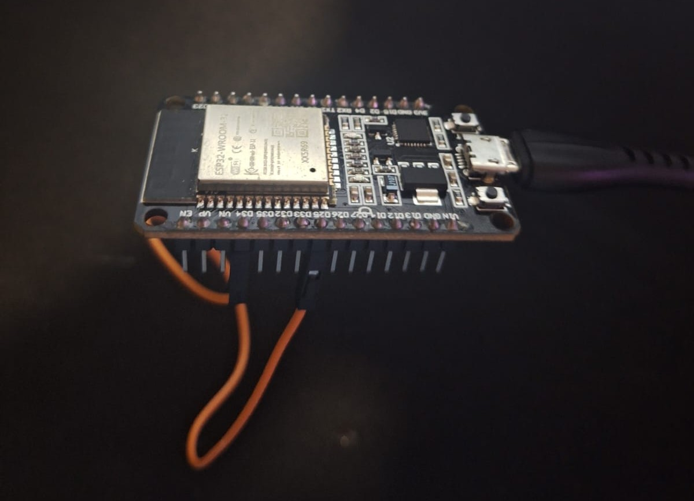
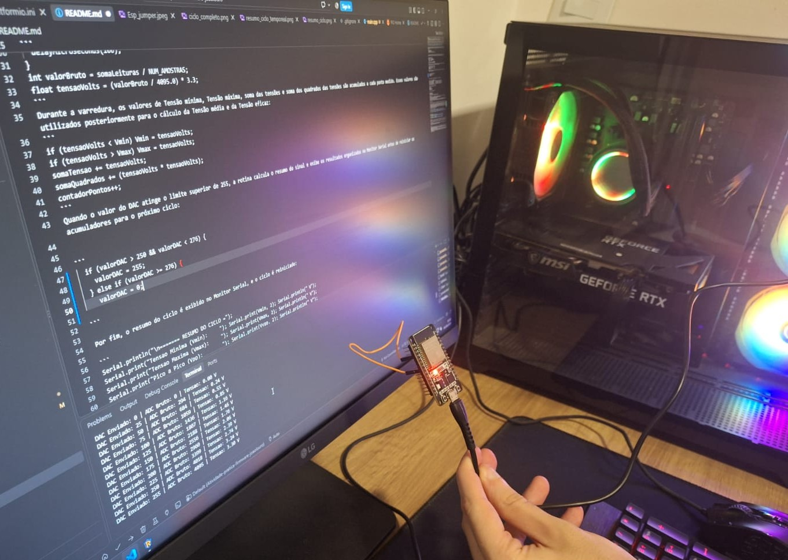
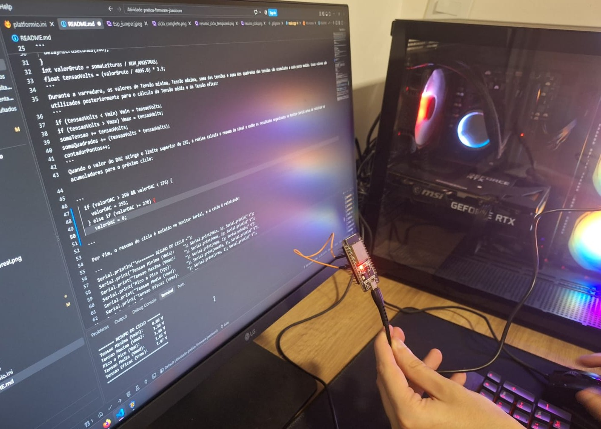
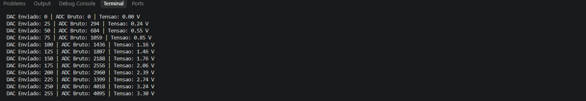
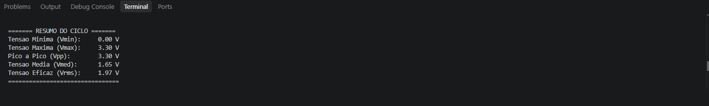

Aquisição e Análise de Sinal Analógico com ESP32

Para este projeto, foi escolhido o microcontrolador ESP32 e o editor de código-fonte Visual Studio Code (VS Code) em conjunto com a extensão PlatformIO por três motivos principais: 
- O ESP32 dispõe de periféricos integrados para geração e aquisição de sinais analógicos, permitindo a implementação do experimento sem a necessidade de conversores externos.
- O VS Code oferece um ambiente leve, moderno e personalizável para edição do código.
- O PlatformIO automatiza o gerenciamento de bibliotecas, facilita a compilação e simplifica o monitoramento serial, tornando o desenvolvimento muito mais ágil e organizado.

O objetivo do firmware é analisar a geração e a leitura de sinais analógicos. O sistema utiliza a saída analógica para gerar patamares de tensão e a entrada analógica para capturar esses valores, calculando em tempo real os parâmetros elétricos de tensão mínima, tensão máxima, tensão pico a pico, tensão média e tensão eficaz.

Hardware e Conexão: A conexão física é realizada conectando diretamente o pino GPIO 25 (saída do DAC) ao pino GPIO 34 (entrada do ADC).




No código, a função setup inicializa a comunicação serial em 115200 baud, define a resolução de leitura do ADC em 12 bits (faixa de 0 a 4095) e ajusta a atenuação do canal em 11 dB utilizando a configuração disponível na plataforma para ampliar a faixa de tensão mensurável pelo conversor.
Código da função:
```
void setup() {
  Serial.begin(115200);
  analogReadResolution(12);
  analogSetPinAttenuation(GPIO_ADC, ADC_11db);
}
```

Lógica do Código e Funcionamento: A tensão de saída é atualizada no DAC em degraus de 25 unidades. Para reduzir a influência de ruídos nas leituras do ADC, o código realiza a média de 10 amostras consecutivas a cada ponto de medição, com intervalo de 100 microssegundos entre as leituras:

```
dacWrite(GPIO_DAC, valorDAC);
long somaLeituras = 0;
for (int i = 0; i < NUM_AMOSTRAS; i++) {
  somaLeituras += analogRead(GPIO_ADC);
  delayMicroseconds(100);
}
int valorBruto = somaLeituras / NUM_AMOSTRAS;
float tensaoVolts = (valorBruto / 4095.0) * 3.3;
```
Durante a varredura, os valores de tensão mínima, tensão máxima, soma das tensões e soma dos quadrados das tensões são acumulados a cada ponto medido. Esses valores são utilizados posteriormente para o cálculo da tensão média e da tensão eficaz:
```
if (tensaoVolts < Vmin) Vmin = tensaoVolts;
if (tensaoVolts > Vmax) Vmax = tensaoVolts;
somaTensao += tensaoVolts;
somaQuadrados += (tensaoVolts * tensaoVolts);
contadorPontos++;
```
Quando o valor do DAC atinge o limite superior de 255, a rotina calcula o resumo do sinal e exibe os resultados organizados no Monitor Serial antes de reiniciar os acumuladores para o próximo ciclo:


```
  if (valorDAC > 250 && valorDAC < 276) {
    valorDAC = 255;
  } else if (valorDAC >= 276) {
    valorDAC = 0;
  }
```

Por fim, o resumo do ciclo é exibido no Monitor Serial, e o ciclo é reiniciado:

```
Serial.println("\n======= RESUMO DO CICLO =");
Serial.print("Tensao Minima (Vmin):     "); Serial.print(Vmin, 2); Serial.println(" V");
Serial.print("Tensao Maxima (Vmax):     "); Serial.print(Vmax, 2); Serial.println(" V");
Serial.print("Pico a Pico (Vpp):        "); Serial.print(Vvpp, 2); Serial.println(" V");
Serial.print("Tensao Media (Vmed):      "); Serial.print(Vmedia, 2); Serial.println(" V");
Serial.print("Tensao Eficaz (Vrms):     "); Serial.print(Vrms, 2); Serial.println(" V");
Serial.println("==========================\n");

// Reseta os acumuladores para o proximo ciclo
Vmin = 3.3;
Vmax = 0.0;
somaTensao = 0.0;
somaQuadrados = 0.0;
contadorPontos = 0;

Serial.println(" Reiniciando Ciclo ...");
```

Mecanismos necessários:
- ESP32 e cabo USB.
- Jumper fêmea-fêmea.
- VS Code e sua extensão PlatformIO instalados no computador.

Como executar:
- Primeiramente, é necessário um ESP32 e um jumper fêmea-fêmea. Além disso, é preciso instalar o VS Code e, dentro dele, a extensão PlatformIO.
- Abra a pasta do projeto no VS Code com a extensão do PlatformIO instalada.
- Interconecte os pinos GPIO 25 e GPIO 34 no seu ESP32.
- Conecte o ESP32 ao computador via cabo USB.
- Na barra inferior do VS Code (ou na aba do PlatformIO), clique no ícone de marca de seleção (Build) para compilar e no ícone de seta (Upload) para gravar o código na placa.
- Abra o Monitor Serial configurado para 115200 baud. Após isso, pressione o botão Reset do ESP32 para visualizar as leituras e o resumo do ciclo em tempo real.

Testes e Validação:

Para validar o funcionamento do firmware e a integridade da leitura analógica, foi realizado um teste prático de loopback:

- O pino emissor (GPIO 25 - DAC) foi interconectado diretamente ao pino leitor (GPIO 34 - ADC) através de um jumper.
- O firmware executa uma varredura gerando uma variação crescente de tensão em degraus, incrementando a saída do DAC em passos de 25 unidades e incluindo o valor máximo de 255 no final da varredura.
- A cada degrau de tensão gerado, o ADC realiza a leitura analógica bruta e converte o valor para Volts, calculando as métricas elétricas ao final de cada ciclo completo.
- O teste demonstrou a capacidade do sistema em acompanhar a variação da saída analógica em tempo real, cobrindo a faixa de 0,00 V até aproximadamente 3,3 V.
- Foi validado o processamento em tempo real dos parâmetros do sinal, incluindo tensão mínima ($V_{min}$), tensão máxima ($V_{max}$), tensão pico a pico ($V_{pp}$), tensão média ($V_{med}$) e tensão eficaz ($V_{rms}$).

Ciclo e resumo do ciclo em tempo real:






Resultados obtidos:
<p><strong>Ciclo completo:</strong></p>


<p><strong>Resumo do ciclo:</strong></p>



Limitações:
- O sinal gerado via software varia a saída em degraus com incrementos discretos de 25 unidades no DAC, resultando em uma forma de onda que não é perfeitamente contínua no tempo.
- O conversor ADC e o DAC do ESP32 apresentam desvios de linearidade próximos a 0V e 3.3V, gerando um pequeno offset nas leituras das extremidades do sinal.

Possíveis melhorias:
- Implementar envio dos dados por protocolo MQTT ou comunicação serial via scripts Python para plotar os gráficos das formas de onda lidas em tempo real.
- Implementar o armazenamento desses dados em um banco de dados.


Referências:

- ESPRESSIF SYSTEMS. ESP32-WROOM-32 Datasheet. Disponível em: https://documentation.espressif.com/esp32-wroom-32_datasheet_en.pdf. Acesso em: 03 set. 2026.
- ESPRESSIF SYSTEMS. Analog to Digital Converter (ADC) - ESP-IDF Programming Guide. Disponível em: https://docs.espressif.com/projects/esp-idf/en/latest/esp32/api-reference/peripherals/adc.html. Acesso em: 03 set. 2026.
- ESPRESSIF SYSTEMS. Arduino-ESP32 - ADC API. Disponível em: https://docs.espressif.com/projects/arduino-esp32/en/latest/api/adc.html. Acesso em: 04 set. 2026.
- PLATFORMIO. Espressif 32 - PlatformIO Documentation. Disponível em: https://docs.platformio.org/en/latest/platforms/espressif32.html. Acesso em: 03 set. 2026.
- Ferramenta de Inteligência Artificial (Gemini) utilizada para auxílio na estruturação e formatação da documentação no repositório. Disponível em: https://gemini.google.com.  Acesso em: 04 set. 2026.